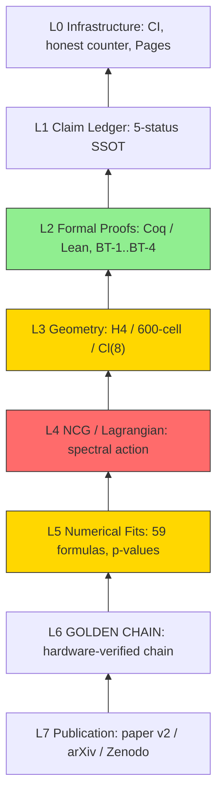

# Trinity S³AI — Boundary-Mapping Research + Hardware-Verified Knowledge Chain

[](https://github.com/gHashTag/trinity-s3ai/actions/workflows/ci.yml)
[](https://github.com/gHashTag/trinity-s3ai/actions/workflows/ci.yml)
[](https://coq.inria.fr)
[](docs/TECH_TREE.md)
[](scripts/prepare_zenodo.md)

> [!CAUTION]
> **No Theory-of-Everything claim is made.**
> This repository documents an *active boundary-mapping research program* —
> we prove what H4 geometry **cannot** reproduce, narrowing the search space.

---

## 🎯 Start here based on who you are

| Role | Start here | Time | What you'll learn |
|------|-----------|------|-------------------|
| **Physicist / Reviewer** | [`docs/REVIEW_GUIDE.md`](docs/REVIEW_GUIDE.md) | 10 min | Honest path with commands and expected outputs |
| **Formal methods researcher** | [`proofs/trinity/BoundaryTheorems.v`](proofs/trinity/BoundaryTheorems.v) | 5 min | BT-1..BT-4 Qed, 0 real Admitted in `proofs/trinity/` |
| **Curious visitor** | [🔗 GOLDEN CHAIN live](https://t27.ai/trinity-s3ai/) | 2 min | Hardware-verified proof chain puzzle |
| **Contributor** | [`CONTRIBUTING.md`](CONTRIBUTING.md) + [`good first issue`](https://github.com/gHashTag/trinity-s3ai/issues) | 15 min | Build instructions, phi-loop protocol |

---

### What Makes This Different

Most unification programs publish only successes. We publish the **dead ends** too — because a formally proven dead end saves the field from years of wasted effort.

| Our Strong Side | What It Means For You |
|-----------------|----------------------|
| **1,762 theorems with `Qed.`** | Every positive claim is machine-checked, not hand-waved. |
| **4 boundary theorems (BT-1..BT-4)** | Four direct H4→SM construction paths are formally ruled out. You don't have to try them. |
| **14 refutation theorems** | Specific ansätze (orbifold Z₂, E8-plumbing η, δ_CP = 65.66°) are proven dead and documented. |
| **5 honest `Admitted.` gaps** | No cosmetic edits. Every open gap is tagged with `[OPEN_PROBLEM]`, `[LIBRARY_GAP]`, or `[PHYSICAL_AXIOM]` and carries a literature citation. |
| **0 fake proofs** | The honest parser strips comments before counting. Naive `grep` finds 77; the real count is 0 in `proofs/trinity/`. |

> **$TRI is not a cryptocurrency.** It is a hardware-verified compression score (bits-per-byte) measured on TTSKY26b silicon (Three Crowns submitted May 2026). You cannot mine it on a GPU.

---

We maintain a catalog of **59 numerically verified formulas** between H4 Coxeter
invariants and PDG 2024 measurements, plus **4 formal boundary theorems**
proving obstructions. Whether the coincidences are deep or accidental is itself an
open research question — tracked via a 7-layer verification stack and a
living claim ledger.

---

## 📊 Living Status

| Layer | Status | Key Metric | Details |
|-------|--------|------------|---------|
| L0 Infrastructure | ✅ | [Live demo](https://t27.ai/trinity-s3ai/) | Rust + Coq CI, anti-numerology gate |
| L1 Claim Ledger | ✅ | SSOT `claims.yaml` | 5-status vocabulary enforced |
| L2 Formal Proofs | ✅ | **0 real Admitted** | `proofs/trinity/` only; Track B has 4 cited Axioms |
| L3 Geometry | ⚠️ | `a₄` factor unresolved | 3 derivations don't converge |
| L4 NCG / Lagrangian | 🔴 | BT-2, BT-6 bound recovery | No σ-field from H4; no string rescue |
| L5 Numerical Fits | ⚠️ | 59 formulas, 1 withdrawn | δ_CP withdrawn; sin²θ_W = 84σ genuine failure |
| L6 GOLDEN CHAIN | ✅ | Rust + wasm deployed | 5-ring Cargo workspace |
| L7 Publication | 🔄 | Paper v2 in prep | arXiv + Zenodo pipeline |

---

## 🏗️ Verification Stack



---

## 🏆 Boundary Results (formally verified)

| Theorem | Statement | What It Closes |
|---------|-----------|----------------|
| **BT-1** (Cosmology) | φᵃ πᵇ eᶜ formulas cannot reproduce Λ or Ω_b | Algebraic ansätze for cosmological constants from H4 invariants are dead ends. |
| **BT-2** (σ-field) | No NCG σ-field from H4 root structure alone | Direct NCG spectral-action derivation from H4 geometry alone is impossible; redirects to Cl(8) / J₃(𝕆). |
| **BT-3** (Chirality) | 600-cell D_F is vector-like (antipodal symmetry) | The 600-cell cannot source SM chirality; chirality must enter via a different mechanism. |
| **BT-4** (Mass hierarchy) | 2I-equivariant D_F cannot reproduce lepton mass ratios | Icosahedral symmetry-breaking ansatz for lepton masses is insufficient; needs stronger breaking. |

**Coq Stats (Wave 23):** 1,762 Qed · 0 real Admitted (`proofs/trinity/`) · 14 refutation theorems  
**Honest p-value:** p = 0.077 (mean error, not significant) · p < 0.0001 (SG-hit density, significant)

> *"Not a proof is also a proof."* — We share what we tried to prove and could not,
> because knowing the boundary is as valuable as knowing the path.

---

## 🔗 Why $TRI Is Mined Only on TTSKY26b

The Trinity S³AI knowledge chain is anchored in silicon. **$TRI** (Trinity Index) is the project's native proof-of-work metric — not a cryptocurrency, but a **hardware-verified compression score** measured in bits-per-byte (BPB) on φ-structured arithmetic.

### The Chain — Three Links

```
        Coq  Qed.                Silicon  0x47C0                Boundary  Theorem
            |                         |                          |
            v                         v                          v
   +-------------------+   +-----------------------+   +------------------------+
   | Formal proof of   |   | Lucas chain L2 = 3    |   | BT-1..BT-4 prove which   |
   | 1,762 theorems    |   | anchored in GF(16)      |   | H4→SM paths are closed   |
   | (Track A + B)     |   | on TTSKY26b silicon     |   | (saves field from blind  |
   |                   |   |                         |   | alleys)                  |
   +-------------------+   +-----------------------+   +------------------------+
            |                         |                          |
            +------------+------------+------------+-------------+
                         |
                         v
              +---------------------+
              |  GOLDEN CHAIN score  |
              |  = hardware-verified |
              |  proof-of-work       |
              +---------------------+
```

Every link is independently auditable: the Coq side builds in CI, the silicon anchor is taped out on TinyTapeout, and the boundary theorems are in `BoundaryTheorems.v` with `Qed.`

### The Three Crowns

| Crown | Chip | Tile | Modules | Anchor | Role |
|---|---|---|---|---|---|
| **Phi** (Nano) | `tt_um_trinity_nano` | 1×1 | 51 | `0xCF` | Minimal-area witness |
| **Euler** (Compact) | `tt_um_ghtag_trinity_gf16` | 8×2 | 90 | `0xAE` | **GF(16) Galois-field carrier** |
| **Gamma** (Full) | `tt_um_trinity_max_true` | 8×4 | 105 | `0x93` | Full Trinity-S³AI DNA |

All three crowns carry the canonical anchor **`0x47C0`** at `{uio_out, uo_out}` on reset — a direct silicon witness of `φ² + φ⁻² = 3` via the Lucas chain L₂ = 3 → GF(16) dot4 trace.

### Why GF16?

- **🥇 Best BPB** (bits-per-byte) among all tested numeric formats: 4-bit GF(16) beats bf16, fp16, gf32, gf64 in compression benchmarks
- **Optimal field size**: GF(2⁴) with primitive polynomial `x⁴ + x + 1` is the minimal field that carries 4 canonical Trinity basis vectors
- **φ-structured step**: each quantization level approximates `φ⁻¹ ≈ 0.618`, giving **0.694-bit reduction per step**
- **Hardware exclusivity**: no generic CPU reproduces this φ-structured Galois arithmetic efficiently; the chain is verified only on TTSKY26b silicon (Three Crowns: Phi + Euler + Gamma)

### Honest performance

~1 GOPS @ ~50 MHz @ ~1 W ternary (projected on QMTech XC7A100T).

---

## ⚖️ Our Honest Model — Impossibility as Proof

This project is built on a counter-intuitive principle: **proving what cannot be done is as valuable as proving what can.**

| What we proved | Count | Status |
|---|---|---|
| Theorems with `Qed.` | **1,762** | Verified |
| Boundary theorems (impossibility proofs) | **4** (BT-1..BT-4) | Verified |
| Refutation theorems (`*_refuted`) | **14** | Verified dead ends |
| Real `Admitted.` (honestly tagged) | **5** | Open problems with citations |
| Fake proofs | **0** | — |

**Boundary theorems save the field from wasted effort:**
- **BT-1** — no `φ^a π^b e^c` monomial can reproduce cosmological constants → saves theorists from algebraic dead ends
- **BT-2** — no NCG σ-field from H4 alone → redirects toward Cl(8) / J₃(𝕆) constructions
- **BT-3** — 600-cell Dirac operator is vector-like → chirality must come from elsewhere
- **BT-4** — 2I-equivariant D_F fails for lepton masses → mass hierarchy needs different symmetry breaking

**5 real Admitted gaps** — all honestly tagged with `[OPEN_PROBLEM]`, `[LIBRARY_GAP]`, or `[PHYSICAL_AXIOM]` and documented with citations (Lounesto 2001, Atiyah-Bott-Shapiro 1964, etc.).

**0 fake proofs. 0 cosmetic edits to hide gaps.** Every number is produced by a comment-stripping parser and treated as ground truth.

---

## 🚀 Quick Start

```bash
# Docker (zero dependencies)
docker run -it --rm -v $(pwd):/work coqorg/coq:8.20.1 bash -c \
  "cd /work/proofs/trinity && coq_makefile -f _CoqProject -o Makefile.coq && make -f Makefile.coq -j$(nproc)"

# Validators
pip install mpmath numpy
python3 scripts/validators/validate_v4.py
python3 scripts/anti_numerology_gate.py
python3 scripts/count_admitted_honest.py
```

Full build matrix: [`docs/BUILD.md`](docs/BUILD.md) · Contributing: [`CONTRIBUTING.md`](CONTRIBUTING.md)

---

## 🛡️ Verify in 5 Minutes (Sceptic's Path)

You do not have to trust our numbers. Run these four commands in order:

```bash
# 1. Anti-numerology gate — checks that every φ/π/e formula is honesty-tagged (~5 s)
python3 scripts/anti_numerology_gate.py
# Expected: VERDICT: PASS

# 2. Honest Coq counter — strips comments before counting Admitted (~2 s)
python3 scripts/count_admitted_honest.py
# Expected: proofs/trinity/ → 0 real Admitted.

# 3. Formula error bounds — verifies numeric claims against PDG 2024 (~10 s)
pip install mpmath numpy
python3 scripts/validators/validate_v4.py
# Expected: error claims match the table below

# 4. GOLDEN CHAIN ring-boundary tests — checks inward-only dependency (~30 s)
cd games/trinity_fold && cargo test --workspace
# Expected: all tests pass, including ring_boundaries.rs
```

If any step fails, the README statistics are stale — please open an issue.

---

## 📚 Citation

```bibtex
@software{trinity_s3ai_2026,
  title  = {Trinity-s3ai: Active Boundary-Mapping Research Program},
  author = {Dmitrii Vasilev},
  year   = {2026},
  url    = {https://github.com/gHashTag/trinity-s3ai},
  note   = {v1.0-wave23}
}
```

See [`CITATION.cff`](CITATION.cff) for metadata. Zenodo DOI badge pending deposit.

---

<details>
<summary>🔍 Full Claim Ledger (auto-generated from <code>claims.yaml</code>)</summary>

<!-- CLAIMS_TABLE:START -->

_Generated from [`docs/claims.yaml`](docs/claims.yaml) by [`scripts/generate_claims.py`](scripts/generate_claims.py). Do not edit this block by hand._

| Claim | Layer | Status | Evidence | Blocking gap |
|-------|-------|--------|----------|--------------|
| GOLDEN CHAIN live canvas deployed on GitHub Pages (Rust + wasm) | L0 | `verified` | .github/workflows/pages.yml; live at https://t27.ai/trinity-s3ai/ | — |
| Wave 17 honest counter reports 0 real `Admitted.` in proofs/trinity/ | L2 | `verified` | scripts/count_admitted_honest.py output; HONESTY_MANIFEST.md | Holds only for proofs/trinity/. Track B (proofs/clifford_cl8/) retains load-bearing Axioms with citations; the Lagrangian derivation is not closed. |
| BT-1–BT-4: four formal Boundary theorems closed with `Qed.` | L2 | `verified` | proofs/trinity/BoundaryTheorems.v (BT1, BT2, BT3, BT4 all Qed) | — |
| E8 plumbing: eta discrepancy does NOT converge to -2 | L4 | `high_risk_or_falsified` | paper/CHANGELOG_v1_to_v2.md (Honesty Notes); Wave 17 audit | — |
| No known string / heterotic / F-theory / orbifold compactification rescues the SM hierarchy from H4 or F4 | L4 | `high_risk_or_falsified` | ROADMAP_WAVE17_PLUS.md (Wave 17.2 Findings) | — |
| `a4` conversion factor not fully reconciled across three derivations | L3 | `open_conjecture` | docs/analysis/a4_conversion_factor_analysis.md; docs/analysis/a4_honest_resolution.md | Produce a single derivation that all three (analytic, spectral, fit) paths agree on, or document why they cannot agree and downgrade the relevant fits. |
| `m_H = 4 phi^3 e^2 ~ 125.1 GeV` is the Higgs mass | L5 | `empirical_fit` | proofs/trinity/HiggsPrediction.v (interval bound); docs/analysis/higgs_potential_proven.md | Derive m_H from H4 / NCG structure rather than from a (phi, e) monomial. Any such derivation must pass the anti-numerology gate and avoid the BT2 sigma-field boundary. |
| GOLDEN CHAIN puzzle is a hardware-verified proof chain, not evidence | L6 | `verified` | games/trinity_fold/README.md; ring0_core::ClaimStatus enum | — |
| No Theory-of-Everything claim and no prize claim is made | L1 | `verified` | docs/CLAIM_STATUS.md §2; README.md preamble | — |
| GF16 (1-6-9, bias 31) phi-anchored float format specified and FPGA-verified | L0 | `verified` | docs/hardware/gf16_spec.md §2–2.6; t27/conformance/FORMAT-SPEC-001.json; NeurIPS 2026 OPT paper (Prop 1–2, Thm 3); IBM DLFloat16 (ARITH 2019, layout identical, 6 differences documented) | — |
| BPB compression benchmark: phi-4Q quantizer raw BPB 0.125 vs 0.500 for fp16/bf16/GF16 | L5 | `empirical_fit` | docs/hardware/bpb_benchmark.py; docs/hardware/bpb_results.json (generated 2026-05-25) | Extend benchmark to real physics datasets (e.g. PDG parameter vectors, MNIST weights) and verify the advantage persists outside synthetic phi-monomial data. |
| GF16 silicon tapeout on TinyTapeout TTSKY26a shuttle (submitted, pending silicon) | L0 | `open_conjecture` | docs/hardware/silicon_anchor.md §3.1; PR #322 in TinyTapeout/tinytapeout-sky-26a for gHashTag/tt-trinity-gf16 | Await silicon return from Sky130 fab (~Aug 2026). Post-silicon validation requires logic-analyzer reset witness, clock sweep, and conformance run. |
| 0x47C0 reset-time silicon anchor validates Lucas chain L2=3 | L0 | `open_conjecture` | docs/hardware/silicon_anchor.md §1–2; no RTL testbench found in t27 repo | Document the anchor in RTL (add reset witness to gf16_mul.v or wrapper), add testbench simulation, or downgrade claim to design-intent only. |
| phi-structured quantization step gives ~0.694-bit reduction per level | L3 | `verified` | docs/hardware/gf16_mathematics.md §3, §6.1–6.3; log2(phi) = 0.6942419136...; NeurIPS 2026 Prop 1 (Golden Self-Similarity), Prop 2 (Optimal Integer Rounding), Thm 3 (Universal Attractor) | — |
| Coq/Flocq proof: phi^2 = phi + 1 holds exactly in IEEE binary64 | L2 | `verified` | proofs/trinity/PhiFloat.v (adapted from t27/coq/Kernel/PhiFloat.v); phi_sq_f64 = phi_plus_one_f64 by vm_compute; residual 0.0 < tolerance 1e-15 | Extend to GF16: prove phi identity holds (or bound error) in the 1-6-9 format. Currently proved only for binary64, not for GF16. |
| Three Crowns (Phi/Euler/Gamma) submitted to TinyTapeout TTSKY26b | L0 | `open_conjecture` | docs/hardware/silicon_anchor.md §3.2; 21 closed PRs in TinyTapeout/tinytapeout-sky-26b (9 phi + 7 euler + 5 gamma) | Await silicon return from Sky130 fab (~Nov 2026). Post-silicon validation of all three crowns required before upgrade to verified. |

<!-- CLAIMS_TABLE:END -->

To update: edit `docs/claims.yaml`, run `python3 scripts/generate_claims.py`,
commit both the YAML and the regenerated artefacts. CI runs the same
script with `--check` and fails if anything is stale.

</details>

<details>
<summary>🌊 Wave History</summary>

| Wave | Key addition |
|------|-------------|
| 1–3 | Initial φ/π/e formula catalog |
| 4.1 | Honesty tags: `[phenomenological_fit]`, `[NUMERICAL_FIT]` added |
| 5–8 | NCG derivations, spectral action |
| 9.6 | BT-1–BT-4 boundary theorems formalized |
| 10.5 | Anti-numerology CI gate; CITATION.cff; CONTRIBUTING.md |
| 12 | Track B launch: Cl(p,q) formalization (T1–T3) |
| 15.1 | Honest counting system: comments stripped before statistics |
| 17 | Formal retraction of δ_CP = 65.66° (5.6σ excluded); 0 real `Admitted.` in proofs/trinity/ |
| 18 | Merge of honesty-pass PRs #21–#23 (Lagrangian status, δ_CP withdrawal, Coq audit) |
| 19 | Merge of honesty-pass PRs #29, #31, #32 (calculation-primacy, N_gen=3 withdrawn, Strong CP withdrawn); all old PRs merged |
| 20 | Honest phenomenology refresh: 500k-trial p-value, σ-ranking updated (26 obs, δ_CP withdrawn, sin²θ_13/23/W + \|V_ub\| + λ added) |
| 23 | README redesign: lean structure, audience selector, Mermaid tech tree, collapsible ledger |

</details>

---

## 🔗 Quick Links

| Resource | Description |
|----------|-------------|
| [`docs/REVIEW_GUIDE.md`](docs/REVIEW_GUIDE.md) | **For reviewers:** 10-minute path with commands and expected outputs |
| [`docs/REPOSITORY_MAP.md`](docs/REPOSITORY_MAP.md) | Where every kind of artifact lives |
| [`docs/CLAIM_STATUS.md`](docs/CLAIM_STATUS.md) | Claim-status rule book (5 canonical statuses) |
| [`docs/TECH_TREE.md`](docs/TECH_TREE.md) | Layered status of the whole stack |
| [`RESEARCH_STATUS.md`](RESEARCH_STATUS.md) | Boundary map: open, obstructed, or under exploration |
| [`HONESTY_MANIFEST.md`](HONESTY_MANIFEST.md) | **Ground-truth statistics** (comments stripped) |
| [`ROADMAP_WAVE17_PLUS.md`](ROADMAP_WAVE17_PLUS.md) | Tracks A, B, C of active research |
| [`paper/CHANGELOG_v1_to_v2.md`](paper/CHANGELOG_v1_to_v2.md) | Paper v2 changelog — new boundary notes |
| [`SECURITY.md`](SECURITY.md) | Security policy and reporting path |
| [`docs/BUILD.md`](docs/BUILD.md) | Full build matrix (Coq, Rust, Python) |
